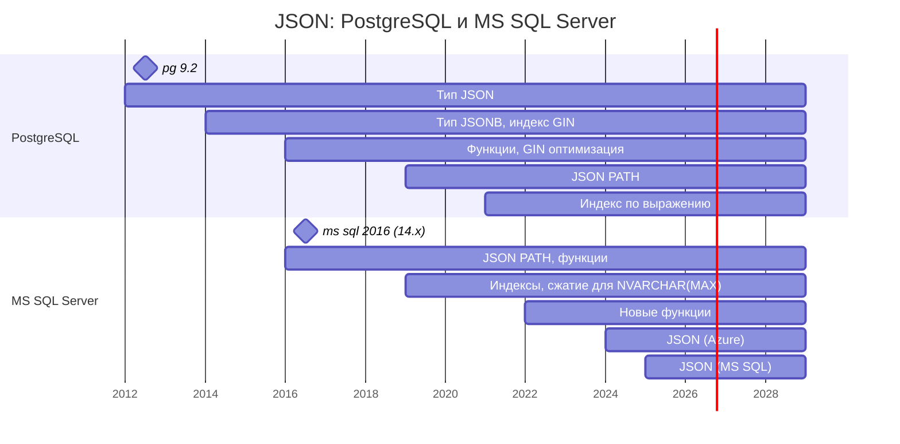

# JSON в SQL Server 2025 vs PostgreSQL JSONB: архитектура, индексы, производительность
Понимание истории работы с JSON в обеих СУБД — ключ к осознанию их текущих архитектурных различий. Пути PostgreSQL и Microsoft SQL Server к поддержке JSON кардинально различаются как по времени, так и по философии.

## PostgreSQL: Долгий путь к зрелости
История поддержки JSON в PostgreSQL началась значительно раньше и прошла через несколько важных этапов.

### 2012 год: Появление типа JSON
В версии 9.2 PostgreSQL представила первый тип данных для работы с JSON. Это был текстовый тип, который:
* Хранил точную копию входного текста
* Сохранял все пробелы и порядок ключей
* Требовал повторного парсинга при каждом обращении 
* Не поддерживал индексацию   

По сути, это был аналог подхода, который позже выбрал SQL Server.

### 2014 год: Революционный JSONB
Настоящим прорывом стала версия PostgreSQL 9.4, вышедшая в декабре 2014 года, с новым типом данных **jsonb**. Это был осознанный шаг навстречу разработчикам, работающим с гибкими схемами данных.
Ключевые отличия jsonb от обычного json:
* Бинарное хранение — данные преобразуются в оптимизированный двоичный формат
* Более быстрые чтения — не требуется повторный парсинг
* Поддержка индексации — возможность создавать GIN-индексы для эффективного поиска
* Каноническая форма — не сохраняет пробелы, сортирует ключи, удаляет дубликаты
* Большое количество встроенных функций
* Основной недостаток — вставка данных в jsonb происходит немного медленнее из-за накладных расходов на преобразование в бинарный формат.  

С этого момента PostgreSQL стал рассматриваться не просто как реляционная СУБД, а как полноценное гибридное хранилище, способное конкурировать с NoSQL-решениями.

### 2019 год: поддержка языка путей SQL/JSON
Добавлены выражения путей SQL/JSON, извлекаемые из данных JSON (аналог выражений XPath в XML). В PostgreSQL выражения путей представляются в виде типа данных jsonpath.


## SQL Server: От текста к нативному формату
Подход Microsoft был иным: долгие годы JSON существовал в SQL Server как «текст с удобными функциями», и лишь в 2025 году ситуация кардинально изменилась.

### 2016 год: Первые шаги
SQL Server 2016 впервые ввел поддержку JSON. Однако данные по-прежнему хранились в `NVARCHAR(MAX)` — обычном текстовом формате.
* Новый функционал:
  * [JSON_VALUE](https://learn.microsoft.com/ru-ru/sql/t-sql/functions/json-value-transact-sql) — извлечение скалярных значений
  * [JSON_QUERY](https://learn.microsoft.com/ru-ru/sql/t-sql/functions/json-query-transact-sql) — извлечение фрагментов JSON
  * [OPENJSON](https://learn.microsoft.com/ru-ru/sql/t-sql/functions/openjson-transact-sql) — преобразование JSON в реляционные строки
  * [ISJSON](https://learn.microsoft.com/ru-ru/sql/t-sql/functions/isjson-transact-sql) — проверка валидности
  * [FOR JSON](https://learn.microsoft.com/ru-ru/sql/relational-databases/json/format-query-results-as-json-with-for-json-sql-server) — формирование JSON из табличных данных
  * [JSON_MODIFY](https://learn.microsoft.com/ru-ru/sql/t-sql/functions/json-modify-transact-sql) — обновление значений  

* Валидация JSON не выполнялась автоматически — разработчикам приходилось использовать `CHECK(ISJSON(column) = 1)` для обеспечения целостности.
* Поскольку JSON хранился как `NVARCHAR(MAX)`, прямой индекс на него наложить было нельзя. Решение заключалось в создании виртуального столбца (в т.ч. non-persisted), который извлекал нужное значение через JSON_VALUE, и последующем индексировании этого столбца. Повкольку это стандартный B-tree некластеризованный индекс, он ограничен 1700 байтами. Если JSON_VALUE вернет длинную строку, DML-операция может завершиться ошибкой.
```sql
-- 1: вычисляемый столбец, извлекающий значение из JSON
ALTER TABLE dbo.Orders
ADD vCustomerId AS JSON_VALUE(order_details, '$.customer_id');

-- 2: индекс на вычисляемом столбце
CREATE INDEX idx_soh_json_CustomerId
ON dbo.Orders(vCustomerId);
```

### 2022 год: Эволюция без революции
SQL Server 2022 добавил новые функции, но хранение осталось прежним:
* [JSON_PATH_EXISTS](https://learn.microsoft.com/ru-ru/sql/t-sql/functions/json-path-exists-transact-sql) — проверка существования пути
* [JSON_OBJECT](https://learn.microsoft.com/ru-ru/sql/t-sql/functions/json-object-transact-sql) и [JSON_ARRAY](https://learn.microsoft.com/ru-ru/sql/t-sql/functions/json-array-transact-sql) — упрощенное конструирование
* [ISJSON](https://learn.microsoft.com/ru-ru/sql/t-sql/functions/isjson-transact-sql?view=sql-server-ver17#json_type_constraint) с расширенной проверкой типа (параметр `json_type_constraint` - `VALUE`, `ARRAY` или `OBJECTSCALAR`). Например, теперь можно проверить, что документ — именно объект, а не массив.  

Однако фундаментальная проблема сохранялась: JSON был просто текстом со всеми вытекающими последствиями — медленные чтения, ограниченная индексация, отсутствие автоматической валидации.

### 2024-2025: Долгожданный прорыв
В 2024 году в Azure SQL Database появился нативный бинарный тип json. А в 2025 году Microsoft анонсировала его для SQL Server 2025.  
Новый тип json предлагает те же преимущества, что и PostgreSQL jsonb:
* Бинарный (UTF-8) формат хранения + оптимизированное сжатие
* Автоматическая валидация с указанием точной позиции ошибки
* Более эффективные чтения — документ уже распарсен
* Индексация - `CREATE JSON INDEX`
* Новые функции: `JSON_ARRAYAGG`, `JSON_OBJECTAGG`, `JSON_CONTAINS`
* Частичные обновления (in-place) без перезаписи всего документа, метод .modify.

## Сравнительный таймлайн



## Примеры работы с JSON

### 1. Создание таблицы и генерация данных
```sql
-- ms sql server
CREATE TABLE dbo.Orders
(
    orderid INT IDENTITY PRIMARY KEY,
    order_details JSON NOT NULL  -- нативный тип, а не NVARCHAR(MAX)
);

-- postgesql
CREATE TABLE public.orders (
    orderid INT GENERATED ALWAYS AS IDENTITY PRIMARY KEY,
    order_details JSONB NOT NULL -- jsonb
);
```

Разница в заполнении данными отражает фундаментальное различие философий:
* [SQL Server 2025](./mssql/1-mssql-generate-data.sql): JSON — это нативный тип хранения, но функции конструирования (`JSON_OBJECT`, `FOR JSON PATH`) всё ещё наследуют текстовую природу и требуют явных указаний `RETURNING JSON / JSON_QUERY`, чтобы не экранировать вложенность. Нативный тип ускоряет чтение и валидацию, но не устраняет сложность конструирования.
* [PostgreSQL](./postgesql/1-postgresql-generate-data.sql): jsonb — это полноценный тип данных с самого начала. Функция `jsonb_build_object` возвращает jsonb, вложенность сохраняется естественно, случайность генерируется тривиально. Код заполнения — прямое следствие того, что JSON здесь не «текст с функциями», а такой же базовый тип, как int или text.

### 2. Загрузка\выгрузка данных

|          | SQL Server 2025 (bcp)                  | PostgreSQL (COPY)      |
|----------|----------------------------------------|------------------------|
| Выгрузка на диск | 17 015 мс (≈ 17 сек) <br> 58 771 строк/сек | 12 012 мс (≈ 12 сек) <br> 83 250 строк/сек |
| Загрузка с диска | 84 800 мс (≈ 85 сек) <br> 11 800 строк/сек               | 22 845 мс (≈ 23 сек) <br> 43 773 строк/сек |

В тестах на 1 000 000 JSON-документов PostgreSQL показал почти двукратное преимущество на выгрузке и четырехратное - на загрузке. Причина не в «медленности» SQL Server как таковой, а в архитектуре bulk-операций: серверный [COPY в PostgreSQL](./postgesql/2-postgresql-copy.sql) работает «из базы напрямую», тогда как [bcp в SQL Server](./mssql/2-mssql-bcp.txt) вынужден идти через клиента, а нативный тип json добавляет валидацию каждой строки. Для сценариев, где JSON-данные активно загружаются и выгружаются, это даёт PostgreSQL ощутимое практическое преимущество.

### 3. Размер хранилища 

```sql
-- ms sql server
SELECT SUM(used_page_count) * 8 / 1024.0 AS used_mb
FROM sys.dm_db_partition_stats
WHERE object_id = OBJECT_ID('dbo.Orders');             -- 529.8 MB

-- postgresql
SELECT pg_size_pretty(pg_table_size('public.orders')); -- 536 MB
-- Размер индекса PK
SELECT pg_size_pretty(pg_indexes_size('public.orders')); -- 21 MB
```
 
* В PostgreSQL большие значения автоматически уходят в TOAST-таблицу и сжимаются. Одна строка в среднем весит ~200–500 байт, поэтому TOAST не задействован — все данные лежат in-row. 
* В SQL Server 2025 нативный тип json тоже хранится в бинарном виде (UTF-8) и не уходит в LOB при таком размере. Поэтому оба движка показывают практически одинаковый «сырой» размер данных.

По плотности хранения JSON SQL Server 2025 и PostgreSQL практически сравнялись, но PostgreSQL платит дополнительно ~4% за отдельный индекс первичного ключа, тогда как SQL Server «прячет» PK внутри кластерного индекса.


### 4. Производительность чтения (без индекса по json-полю)
### 4.1. Извлечение скалярного значения 
```sql
-- ms sql server
SELECT COUNT(*) FROM dbo.orders 
WHERE JSON_VALUE(order_details, '$.customer_id') = 5000;

-- postgresql
SELECT COUNT(*) FROM public.orders 
WHERE order_details->>'customer_id' = '5000';

```
### 4.2. Фильтрация по JSON-массиву:
```sql
-- ms sql server
SELECT COUNT(*) 
FROM dbo.orders 
WHERE JSON_CONTAINS(order_details, 540, '$.items[*].product_id') = 1;

-- postgresql
SELECT COUNT(*) 
FROM public.orders  
WHERE jsonb_path_exists(order_details, '$.items[*].product_id ? (@ == 540)');
```
### 4.3 Обновление одного поля (частичное обновление):

```sql
-- ms sql server
UPDATE dbo.Orders SET order_details.modify('$.status', 'shipped') 
WHERE JSON_VALUE(order_details, '$.customer_id') = 5000;

-- postgresql
UPDATE public.orders 
SET order_details = jsonb_set(order_details, '{status}', '"shipped"')
WHERE order_details->>'customer_id' = '5000';
```
Оба подхода позволяют выполнять частичное обновление без перезаписи всего документа. Раньше в SQL Server функция `JSON_MODIFY` перезаписывала весь NVARCHAR(MAX) целиком, что было неэффективно.  

В любом случае, без индекса по полю orders_data приходится прочитывать весь набор из миллиона строк (Clustered Index Scan или Seq Scan).

## 5. Индекс

### SQL Server 2025: «плоская проекция» JSON
JSON-индекс физически реализован как внутренняя таблица (*INTERNAL_TABLE*), где каждая строка — это отдельный скалярный элемент из JSON-документа. Такая таблица содержит столбцы json_path, sql_value, json_array_index, posting_1 и др. Это «проекция» JSON-документа в реляционные строки, где данные дублируются.  
Создавать такой индекс по всем документам - не оправдано дорого, ведь каждая пара ключ:значение станет строкой внутренней таблицы. Имеет смысл декларативно указать нужные пути поиска при создании индекса: 
```sql
CREATE JSON INDEX idx_orders_json 
ON dbo.orders (order_details)
FOR ('$.items', '$.shipping_address', '$.customer_id', '$.total', '$.status')
WITH (OPTIMIZE_FOR_ARRAY_SEARCH = ON, DATA_COMPRESSION = PAGE);
```

Плюсы:
* Прозрачная модель для понимания.
* Естественная поддержка массивов.
* Сжатие ROW/PAGE

Минусы:
* Дублирование данных: каждая часть JSON хранится и в документе, и в индексе.
* sql_variant для хранения значений — компромисс, влияющий на сравнение.
* Ограничение в один JSON-индекс на столбец.
* `ONLINE = ON` не поддерживается. Создание, перестроение или удаление JSON-индекса получает блокировку модификации схемы (Sch-M) на таблице на всё время операции. Это предотвращает доступ  к базовой таблице во время перестроения (таблица полностью недоступна для чтения и записи).


### PostgreSQL «инвертированный индекс» JSONB (GIN) 
GIN (Generalized Inverted Index) — это классический инвертированный индекс, встроенный в движок PostgreSQL. Он хранит пары (key, posting list), где key — это элемент JSON-документа (например, конкретный product_id или ключ customer_id), а posting list — список идентификаторов строк (heap pointers), где этот key встречается.
```sql
CREATE INDEX idx_orders_json 
ON public.orders USING GIN (order_details);
```

#### Плюсы:
* Компактность при дублировании: если одно и то же значение (product_id = 540) встречается в тысячах документов, оно хранится в индексе один раз — как ключ с длинным списком указателей на строки.
* Универсальность: поддержка раздичных операторов класса jsonb_ops: `@>, ?, ?|, ?&, @?, @@`.
* Нет дублирования данных: индекс хранит только ключи и указатели, а не копии JSON-значений.
* Один индекс — все поля: GIN индексирует все ключи и значения внутри JSONB, не требуя перечисления конкретных путей.

#### Минусы:
* Медленные вставки/обновления: одна строка JSONB может содержать десятки ключей, и каждое обновление порождает множество вставок в индекс.
* Механизм fastupdate: PostgreSQL смягчает это через буфер pending entries, но при его переполнении происходит массовая очистка, которая может замедлить запросы.
* Нет выборочной индексации: GIN индексирует всё подряд, что может быть избыточно, если нужен поиск только по 2-3 полям.

В MS SQL Server вы декларативно указываете пути при создании индекса. В PostgreSQL вы либо создаете индекс на конкретном выражении (для точечного поиска), либо создаете GIN-индекс на конкретном фрагменте JSONB (для поиска по массиву), либо используете jsonb_path_ops для экономии места.

### 6. Производительность чтения (с индексом по json-полю)
### SQL Server 2025
JSON-индекс оптимизирован только для функции `JSON_CONTAINS` по оператору сравнения (=): поиск значений, включая массивы через [*]. 

```sql
-- не использует json-индекс
SELECT COUNT(*) 
FROM dbo.orders 
WHERE JSON_VALUE(order_details, '$.customer_id') = 5000;

-- использует json-индекс
SELECT COUNT(*) 
FROM dbo.orders 
WHERE JSON_CONTAINS(order_details, 5000, '$.customer_id') = 1;
-- Table 'Orders'. Scan count 0, logical reads 21, physical reads 0
-- Table 'json_index_1221579390_1216000'. Scan count 1, logical reads 4
```

Индекс не выбирается оптимизатором при поиске строковых значений:
```sql
.. WHERE JSON_CONTAINS(order_details, N'СПб', '$.shipping_address.city') = 1;
```
Поскольку столбец sql_value не имеет единой коллации, оптимизатор не может гарантировать, что сравнение будет корректным при использовании индекса. В результате он выбирает безопасный путь — полное сканирование.

### PostgreSQL
GIN-индекс поддерживает операторы класса jsonb_ops: `@>, ?, ?|, ?&, @?, @@`.   
Нет привязки к коллации.

```sql
-- не использует gin-индекс
SELECT COUNT(*) FROM public.orders
WHERE order_details->>'customer_id' = '5000';

-- использует gin-индекс
explain (analyze, costs off, timing off)
SELECT COUNT(*) FROM public.orders
WHERE order_details @> '{"customer_id": 5000}'::jsonb;
                                 QUERY PLAN
-----------------------------------------------------------------------------
 Aggregate (actual rows=1 loops=1)
   ->  Bitmap Heap Scan on orders (actual rows=7 loops=1)
         Recheck Cond: (order_details @> '{"customer_id": 5000}'::jsonb)
         Heap Blocks: exact=7
         ->  Bitmap Index Scan on idx_orders_json (actual rows=7 loops=1)
               Index Cond: (order_details @> '{"customer_id": 5000}'::jsonb)
 Planning Time: 2.870 ms
 Execution Time: 5.707 ms
```


### 7. Некоторые другие задачи 
### 1. Поиск документов с N элементами массива
#### SQL Server 2025
Запрос даже на 1 миллионе документов невозможно выполнить одним оператором — он падает с ошибкой 701 (insufficient memory), потому что `OPENJSON` с `CROSS APPLY` материализует каждый элемент массива в отдельную строку и требует огромного объёма workspace memory.

Приходится писать цикл по батчам с временной таблицей, накоплением результатов и переходом по диапазонам orderid. Это «инженерное» решение: 15+ строк кода, `WHILE`, `TOP (@batch_size)`, `CROSS APPLY`, временная таблица. Оно работает, но требует ручного управления памятью и усложняет код.

В SQL Server нет функции длины JSON-массива (такой как `JSON_ARRAY_LENGTH`). Единственный способ узнать количество элементов — развернуть массив через `OPENJSON` и посчитать строки. Это неизбежно ведёт к материализации и проблемам с памятью на больших объёмах.

#### PostgreSQL
Аналогичный запрос — одна строка, без батчей, без временных таблиц, без циклов. `jsonb_array_length(...)` возвращает количество элементов массива как целое число. Это метаданные, хранящиеся в самом jsonb: длина массива известна без разворачивания элементов в строки.
```sql
SELECT 
    COUNT(jsonb_array_length(order_details->'items')) AS items_count
FROM public.orders
WHERE jsonb_array_length(order_details->'items') > 4;
```

### 2. Поиск документов с определённым ключом внутри элемента массива

**SQL Server 2022+**: `JSON_PATH_EXISTS(order_details, '$.items[*].discount') = 1` — работает без разворачивания массива, использует wildcard-путь.

**PostgreSQL**: `jsonb_path_exists(data, '$.items[*].discount')` — аналогичный синтаксис SQL/JSON Path.


## ИТОГО
* Зрелость  
PostgreSQL получил бинарный jsonb с индексацией в 2014 году. SQL Server — только в 2025. Разрыв — 11 лет.

* BULK-операции   
Для сценариев, где JSON-данные активно загружаются и выгружаются, PostgreSQL имеет ощутимое практическое преимущество.   

* Индексация  
GIN-индекс — специальная структура на все операторы класса jsonb_ops, не дублирует данные, компактный.  
`JSON INDEX` в SQL Server работает только с функцией `JSON_CONTAINS`, дублирует данные во внутренней таблице, не поддерживает `OPENJSON`.

* Обновления  
PostgreSQL — `jsonb_set()` работает с GIN, обновление индекса автоматическое.   
SQL Server — `.modify()` требует `JSON_CONTAINS` для использования индекса, иначе полное сканирование. JSON-индекс не поддерживает ONLINE-обновление.

* Работа с массивами  
PostgreSQL содержит огромное количество специальных функций: `jsonb_array_length(), jsonb_path_exists(), jsonb_array_elements()` и др. Все они работают с метаданными бинарного формата.  
В SQL Server 2022 появилась функция `JSON_PATH_EXISTS`, но подсчёт элементов массива требует `OPENJSON` с риском исчерпания памяти (ошибка 701).


Нативный json и `CREATE JSON INDEX` в SQL Server 2025 — это шаг вперёд по сравнению с `NVARCHAR(MAX)`. Но по удобству, полноте и предсказуемости работы с JSON он всё ещё сильно уступает PostgreSQL, где jsonb с 2014 года является полноценным типом данных с богатой экосистемой операторов и индексов. Для проектов, где JSON — основа хранения, PostgreSQL остаётся более зрелым выбором. Для гибридных сценариев в экосистеме Microsoft SQL Server 2025 — жизнеспособная альтернатива, но с оговорками.